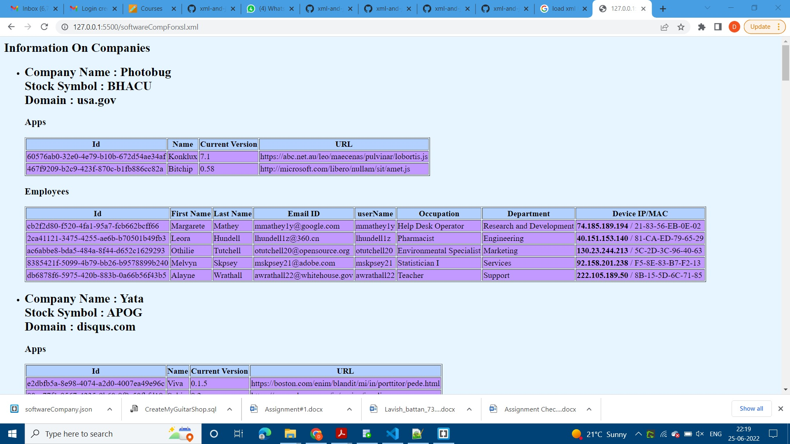

# The project was undertaken as a team activity and the activities to acheive this project were distributed among both the team members.

## The following activities were undertaken by myself.
* json to xml conversion. 
* json was converted  to 'softwareComp.xml' with 'companies' as root element and 'company' as child elements.

* Creation of softwareComp1.xslt.
* XMl data was displayed in tabular form using softwareComp1.xslt.

* softwareComp.html was created in team for dynamically loading xml data into html page. 
